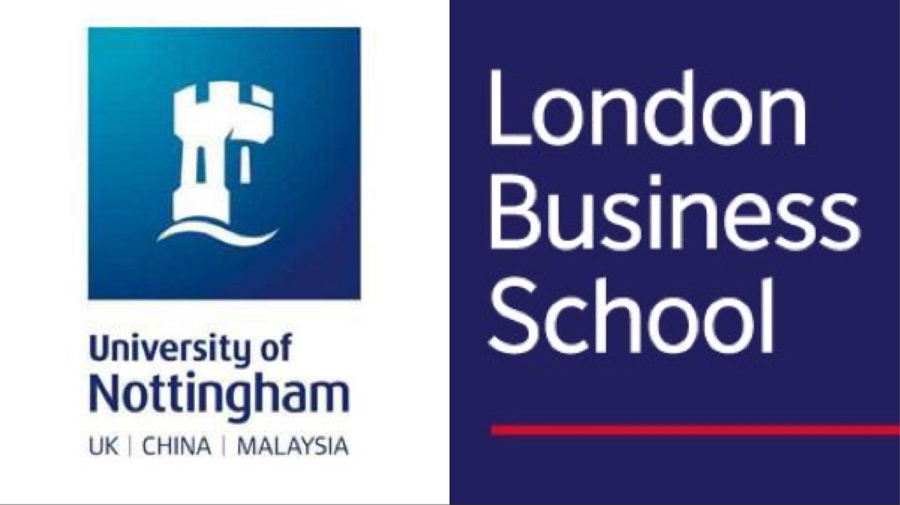

```{r load-libraries, warning=FALSE, message=FALSE, echo=FALSE}
library(tidyverse)  # Load ggplot2, dplyr, and all the other tidyverse packages
library(gapminder)  # gapminder dataset
library(here)
```

>"We are what we think."

My name is **Yuanmeng Gu**. You can call me **Cathy**. I am a goal-oriented and self-motivated person. Everytime I set a goal for myself, I will try my best to achieve it. 

{height=120%, width=120%}

### Education

1. 2016-2020: University of Nottingham - BSc Finance Accounting and Mgt
2. 2020-2021: London Business School - MSc Financial Analysis



### Internships

In terms of my internship, I had 4 internships in total. One in Institutional Sales, one in Investment Banking and two in Research. Through these internships, I became clearer that my passion and interest is indeed in finance industry. 

{width=150%}

### Hobbies & Interests

Regarding my spare time, I would like to practice my entrepreneurial skills, attend voluntary work and do some extreme sports. These activities make me reassess the meaning of my education, my future career, and my whole life. I realize that what motivates me to study and work is to make some positive influences on the community. 


### Contact Me
*Email*: ygu.mfa2021@london.edu\
*LinkedIn*: [click here](https://www.linkedin.com/in/cathy-yuanmeng-gu/)
